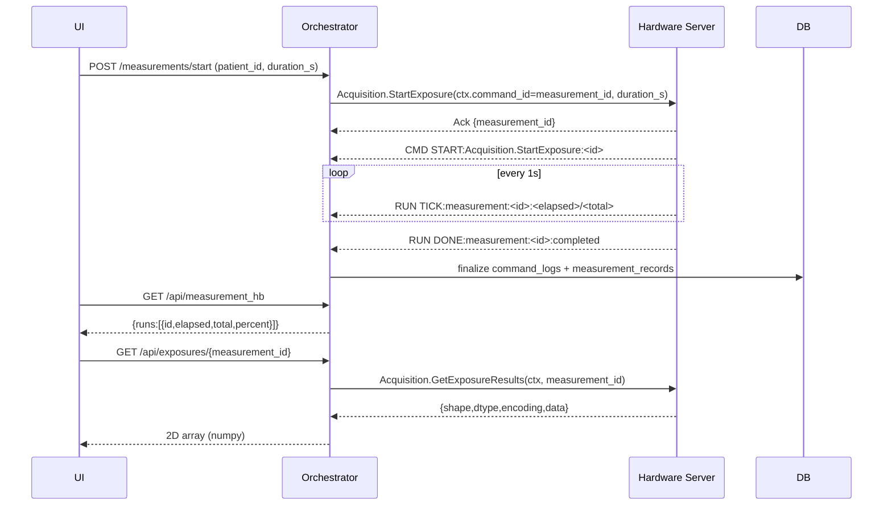
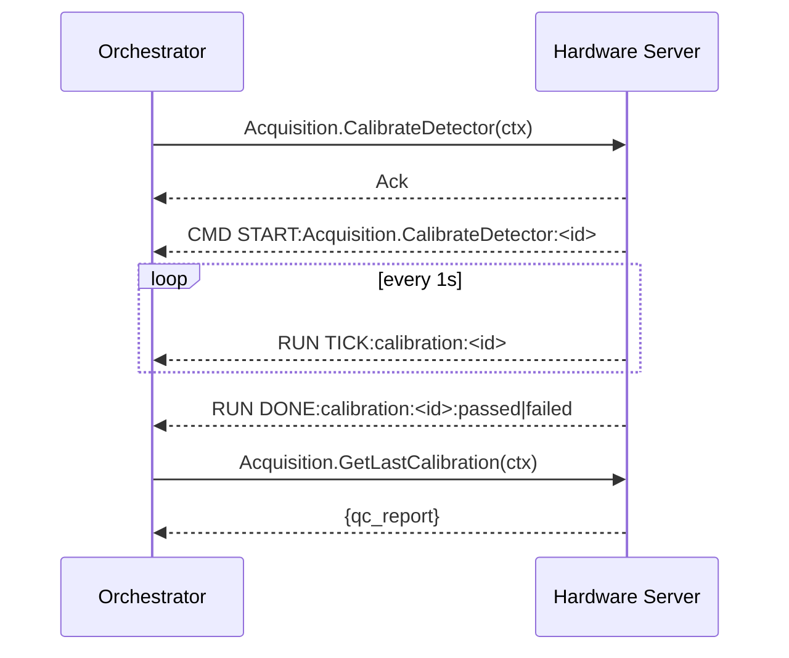
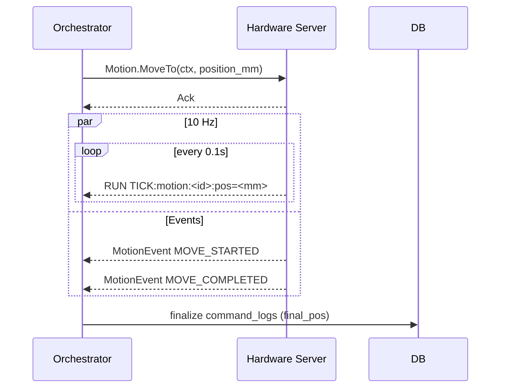

# OMNIScan Hardware Server — Command Catalog and Development Schemes

This document standardizes all gRPC commands, inputs/outputs, required logging, timeouts (in seconds), and the async notification scheme between the Hardware Server (Rust) and the Orchestrator. Use this as the source of truth for implementation and testing.

## Conventions
- All durations are in seconds (s).
- Every RPC includes a CommandContext (`ctx`) with:
  - `command_id` (UUID) — unique operation/run ID; for measurements this equals `measurement_id`.
  - `user` — operator_id (server logs it).
  - `reason` — free text.
  - `timestamp` — UTC.
- Orchestrator must always send `ctx`. Server logs EVERY command (start/finish) with: `command_id`, `operator_id (ctx.user)`, `orchestrator_id` (from mTLS device_uuid when available), `service.command`, `inputs`, `started_at`, `finished_at`, `result`, and optional `error_message`. Server logging is mandatory for all commands.
- Asynchronous operations return an immediate Ack and emit progress via notification streams.

## Notification Scheme
Two broadcast streams (via `StateMonitor.SubscribeToStateUpdates`):

- CMD notifications (per-RPC lifecycle)
  - component: `CMD`
  - change_type: `START:<Service>.<Command>:<command_id>`
  - change_type: `DONE:<Service>.<Command>:<command_id>:success|error[:reason]`

- RUN notifications (long-running “run” lifecycles)
  - Measurements (1 Hz):
    - `START:measurement:<run_id>:<total_secs>`
    - `TICK:measurement:<run_id>:<elapsed>/<total>` (every 1s)
    - `DONE:measurement:<run_id>:completed|failed|stopped|aborted`
  - Calibration (1 Hz):
    - `START:calibration:<run_id>`
    - `TICK:calibration:<run_id>`
    - `DONE:calibration:<run_id>:passed|failed`
  - Background measurement (1 Hz):
    - `START:background:<run_id>:<total_secs>`
    - `TICK:background:<run_id>:<elapsed>/<total>`
    - `DONE:background:<run_id>:completed|failed`
  - Motion (10 Hz):
    - `TICK:motion:<run_id>:pos=<mm>` (every 0.1s during moves/homing)
    - `TICK:motion_home:<run_id>:pos=<mm>:phase=<init|search|backoff|latch|done>`

Clients MUST parse these strings for progress bars and state.

## Server Config (Timeouts)
All in seconds. Example TOML:

```toml
[timeouts]
# Acquisition
start_exposure_ack_s = 1
exposure_done_grace_s = 10
stop_ack_s = 1
abort_ack_s = 1
calibrate_ack_s = 1
calibrate_done_s = 600
background_ack_s = 1
background_done_s = 10
get_state_ack_s = 1
get_exposure_results_ack_s = 5
get_last_calibration_ack_s = 1
get_calibration_ack_s = 2

# Motion
motion_move_ack_s = 1
motion_move_done_s_base = 2
motion_move_done_s_per_mm = 0.1
motion_home_ack_s = 1
motion_home_done_s_margin = 10
motion_stop_ack_s = 1
motion_set_velocity_ack_s = 1
motion_get_position_ack_s = 1

# DeviceInitialization
initialize_detector_ack_s = 1
initialize_detector_done_s = 15
initialize_motion_ack_s = 1
initialize_motion_done_s = 10
poweroff_detector_ack_s = 2
poweroff_motion_ack_s = 2

# DeviceControl
power_device_ack_s = 1
get_detector_health_ack_s = 1
get_motion_health_ack_s = 1
get_device_state_ack_s = 1

# Safety
get_interlock_status_ack_s = 1
reset_interlocks_ack_s = 2
check_safety_ack_s = 1

# Health
liveness_ack_s = 1
readiness_ack_s = 1
aggregate_health_ack_s = 2

# StateMonitor
get_full_server_state_ack_s = 1
get_gpio_state_ack_s = 1
get_detector_state_ack_s = 1
get_motion_state_ack_s = 1
```

## Storage (DB) Requirements
- Server (Rust):
  - `audit.command_logs` — one row per RPC with command_id, operator_id, orchestrator_id, service.command, inputs (JSON), started_at, finished_at, result, error_message?, device_state_before/after?
  - `measurement_records` — `measurement_id` (== command_id), timestamp_start/end, exposure_time_s, data_files, data_size_bytes, checksum?, operator, status (Completed/Failed/Stopped/Aborted/Background).
  - `calibration_records` — id, timestamp, operator, calibrant_material, qc_results_json, poni_file_content, status (VALID/FAILED).
- Orchestrator:
  - `command_logs` — mirror with orchestrator-side timing and outcomes.
  - `measurement_records` — map `measurement_id` ↔ `patient_id`, timestamps, status, data refs.

## Binary Result Format (GetExposureResults)
Response carries matrix as row-major bytes for efficient NumPy reconstruction:
- `{ measurement_id, shape:[rows, cols], dtype:"u16"|"f32", encoding:"raw"|"zstd", data: bytes }`
- NumPy usage: `np.frombuffer(data, dtype).reshape(rows, cols)` (decompress first if `zstd`).

---

# Command Catalog (by Service)

## Acquisition

### StartExposure (StartMeasurement)
- Inputs: `ctx.command_id (UUID == measurement_id)`, `duration_s (int)`
- Exec: Safety checks → start detector async → emit RUN START/TICK/DONE.
- Notifications: `CMD START/DONE`; `RUN START:measurement:<id>:<duration_s>`, `TICK` 1 Hz, `DONE:completed|failed|stopped|aborted`.
- Success: Ack `{ measurement_id }` immediately; data downloadable by `GetExposureResults(measurement_id)`.
- Errors: FAILED_PRECONDITION (safety), INTERNAL (device); also `RUN DONE:…:failed`.
- Timeouts: `start_exposure_ack_s`, `exposure_done_grace_s`.
- DB: Server `command_logs` + `measurement_records` (start/end, status, size); Orchestrator `command_logs` + `measurement_records` (patient mapping).

### Stop
- Inputs: `ctx.command_id`
- Exec: Stop active exposure.
- Notifications: `CMD START/DONE`; `RUN DONE:measurement:<id>:stopped`.
- Success: Ack (Empty) immediately.
- Errors: FAILED_PRECONDITION (no active), INTERNAL (device).
- Timeouts: `stop_ack_s`.
- DB: Update measurement status to Stopped/Cancelled.

### Abort
- Inputs: `ctx.command_id`
- Exec: Emergency stop.
- Notifications: `CMD START/DONE`; `RUN DONE:measurement:<id>:aborted`.
- Success: Ack (Empty).
- Errors: FAILED_PRECONDITION, INTERNAL.
- Timeouts: `abort_ack_s`.
- DB: Update measurement status to Aborted.

### GetState
- Inputs: `ctx.command_id`
- Exec: Quick snapshot of server state + interlocks.
- Success: `GetStateResponse { state, detail, interlocks, timestamp }`.
- Errors/Timeouts: INTERNAL; `get_state_ack_s`.
- DB: Log request/response in command_logs.

### GetExposureResults (replaces GetLastExposureResult)
- Inputs: `ctx.command_id`, `measurement_id (UUID)`
- Exec: Load stored 2D image and return as bytes payload.
- Success: `{ measurement_id, shape, dtype, encoding, data }`.
- Errors/Timeouts: NOT_FOUND/INTERNAL; `get_exposure_results_ack_s`.
- DB: Log with result meta `{shape,dtype,encoding,byte_len}`.

### CalibrateDetector
- Inputs: `ctx.command_id`
- Exec: Safety prechecks → home motion → calibration exposure async → QC.
- Notifications: `CMD START/DONE`; `RUN START/TICK/DONE:passed|failed`.
- Success: Ack; latest QC via `GetLastCalibration()`.
- Errors/Timeouts: FAILED_PRECONDITION/INTERNAL; `calibrate_ack_s`, `calibrate_done_s`.
- DB: `calibration_records` + `command_logs`.

### GetLastCalibration
- Inputs: `ctx.command_id`
- Exec: Fetch most recent calibration QC.
- Success: `{ has_calibration, qc_report? }`.
- Errors/Timeouts: NOT_FOUND/INTERNAL; `get_last_calibration_ack_s`.
- DB: Log request/response.

### GetCalibration (by id)
- Inputs: `ctx.command_id`, `calibration_id (UUID)`
- Exec: Lookup specific calibration; return QC and PONI.
- Success: `{ calibration_id, qc_report {...} }`.
- Errors/Timeouts: NOT_FOUND/INTERNAL; `get_calibration_ack_s`.
- DB: Log with inputs/result.

### StartBackgroundMeasurement (Dark frame)
- Inputs: `ctx.command_id`, `duration_s`
- Exec: Requires radiation_safe=true; start async; emit RUN 1 Hz.
- Notifications: `CMD START/DONE`; `RUN START/TICK/DONE`.
- Success: Ack; result stored/returned similarly to exposure.
- Errors/Timeouts: FAILED_PRECONDITION/INTERNAL; `background_ack_s`, `background_done_s`.
- DB: `measurement_records` type=background + logs.

### SubscribeRunEvents (stream)
- Inputs: none
- Exec: Stream SystemEvent and RUN/CMD events.
- Success: continuous until closed.
- Errors: gRPC stream error.
- DB: Server logs open/close; Orchestrator logs subscription lifecycle.

## Motion

### MoveTo
- Inputs: `ctx.command_id`, `position_mm`
- Exec: Non-blocking; emit 10 Hz `TICK:motion:<id>:pos=<mm>`; MotionEvent MOVE_STARTED/COMPLETED.
- Success: Ack; completion via events; final position via GetPosition.
- Errors/Timeouts: FAILED_PRECONDITION/INTERNAL/LIMIT_HIT; `motion_move_ack_s`, `motion_move_done_s_base + per_mm*Δ`.
- DB: Log + final position meta.

### MoveRelative
- Inputs: `ctx.command_id`, `distance_mm`
- Exec/Notifications/Success/Errors/Timeouts/DB: same as MoveTo (Δ computed from distance).

### Home
- Inputs: `ctx.command_id`
- Exec: Non-blocking homing; emit 10 Hz `TICK:motion_home:<id>:pos=<mm>:phase=<...>`; MotionEvent HOME_COMPLETED.
- Success: Ack; is_homed=true on completion.
- Errors/Timeouts: FAILED_PRECONDITION/INTERNAL; `motion_home_ack_s`, `motion_home_done_s_margin`.
- DB: Log + `{is_homed, final_pos}`.

### Stop (motion)
- Inputs: `ctx.command_id`
- Exec: Stop motion immediately; MotionEvent STOPPED.
- Success: Ack.
- Errors/Timeouts: INTERNAL; `motion_stop_ack_s`.
- DB: Log + `{stopped:true}`.

### SetVelocity
- Inputs: `ctx.command_id`, `velocity_mm_s`
- Exec: Apply velocity parameter.
- Success: Ack.
- Errors/Timeouts: FAILED_PRECONDITION/INVALID_ARG/INTERNAL; `motion_set_velocity_ack_s`.
- DB: Log with inputs.

### GetPosition
- Inputs: `ctx.command_id`
- Exec: Read axis position and homed flag.
- Success: `{ position_mm, is_homed }`.
- Errors/Timeouts: INTERNAL; `motion_get_position_ack_s`.
- DB: Log with result meta.

## DeviceInitialization

### InitializeDetector
- Inputs: `ctx.command_id`
- Exec: Check key_switch/enable_button/radiation_safe → power on/init.
- Success: `DetectorStateResponse`.
- Errors/Timeouts: FAILED_PRECONDITION/INTERNAL; `initialize_detector_ack_s`, `initialize_detector_done_s`.
- DB: Log with result meta.

### InitializeMotion
- Inputs: `ctx.command_id`
- Exec: Safety checks → power on/init motion (no homing).
- Success: `MotionStateResponse`.
- Errors/Timeouts: FAILED_PRECONDITION/INTERNAL; `initialize_motion_ack_s`, `initialize_motion_done_s`.
- DB: Log with result meta.

### PowerOffDetector
- Inputs: `ctx.command_id`
- Exec: Stop exposure if any; power off detector.
- Success: Empty.
- Errors/Timeouts: INTERNAL; `poweroff_detector_ack_s`.
- DB: Log.

### PowerOffMotion
- Inputs: `ctx.command_id`
- Exec: Stop motion; power off controller.
- Success: Empty.
- Errors/Timeouts: INTERNAL; `poweroff_motion_ack_s`.
- DB: Log.

## DeviceControl

### PowerDevice
- Inputs: `ctx.command_id`, `device_type`, `power_on`
- Exec: Power toggle device.
- Success: Empty.
- Errors/Timeouts: INVALID_ARG/INTERNAL; `power_device_ack_s`.
- DB: Log inputs/result.

### GetDetectorHealth
- Inputs: `ctx.command_id`
- Exec: Read detector health.
- Success: `DetectorHealth { powered, temperature, voltage, status, last_exposure_time, total_exposures, uptime_seconds }`.
- Errors/Timeouts: INTERNAL; `get_detector_health_ack_s`.
- DB: Log result meta.

### GetMotionHealth
- Inputs: `ctx.command_id`
- Exec: Read motion health.
- Success: `MotionHealth { powered, status, position?, target_position?, is_homed, total_moves, uptime_seconds }`.
- Errors/Timeouts: INTERNAL; `get_motion_health_ack_s`.
- DB: Log result meta.

### GetDeviceState
- Inputs: `ctx.command_id`, `device_type`
- Exec: Unified state snapshot.
- Success: `DeviceStateResponse { device_type, powered, status, uptime_seconds, outputs{} }`.
- Errors/Timeouts: INVALID_ARG/INTERNAL; `get_device_state_ack_s`.
- DB: Log.

## Safety

### GetInterlockStatus
- Inputs: `ctx.command_id`
- Exec: Read interlocks.
- Success: `InterlockStatus {...}`.
- Errors/Timeouts: INTERNAL; `get_interlock_status_ack_s`.
- DB: Log.

### ResetInterlocks
- Inputs: `ctx.command_id`
- Exec: Attempt to clear fault.
- Success: Empty.
- Errors/Timeouts: FAILED_PRECONDITION/INTERNAL; `reset_interlocks_ack_s`.
- DB: Log.

### CheckSafetyToOperate
- Inputs: `ctx.command_id`
- Exec: Evaluate readiness before operations.
- Success: `InterlockStatus`.
- Errors/Timeouts: INTERNAL; `check_safety_ack_s`.
- DB: Log.

## Health

### Liveness
- Inputs: `ctx.command_id`
- Exec: Ping.
- Success: Empty.
- Errors/Timeouts: UNAVAILABLE/INTERNAL; `liveness_ack_s`.
- DB: Log.

### Readiness
- Inputs: `ctx.command_id`
- Exec: Server readiness gate.
- Success: Empty (ready) or UNAVAILABLE with reason.
- Errors/Timeouts: `readiness_ack_s`.
- DB: Log.

### GetAggregateHealth
- Inputs: `ctx.command_id`
- Exec: Collect component health.
- Success: `AggregateHealth { ok, components[], interlocks }`.
- Errors/Timeouts: INTERNAL; `aggregate_health_ack_s`.
- DB: Log.

## StateMonitor

### SubscribeToStateUpdates (stream)
- Inputs: none
- Exec: Broadcast `CMD` and `RUN` notifications + GPIO/device changes.
- Success: Continuous stream; Errors: gRPC stream error.
- DB: Log open/close.

### GetFullServerState
- Inputs: `ctx.command_id`
- Exec: Snapshot of safety + devices.
- Success: `FullServerStateResponse { safety_state, gpio, detector, motion, timestamp }`.
- Errors/Timeouts: INTERNAL; `get_full_server_state_ack_s`.
- DB: Log.

### GetGpioState
- Inputs: `ctx.command_id`
- Exec: Read key switch, enable button, interlocks, LEDs.
- Success: `GpioStateResponse { powered, key_switch_on, activation_button_active, activation_remaining_secs?, interlocks, main_led, radiation_led }`.
- Errors/Timeouts: INTERNAL; `get_gpio_state_ack_s`.
- DB: Log.

### GetDetectorState
- Inputs: `ctx.command_id`
- Exec: Detector snapshot.
- Success: `DetectorStateResponse { powered, initialized, status, temperature, total_exposures }`.
- Errors/Timeouts: INTERNAL; `get_detector_state_ack_s`.
- DB: Log.

### GetMotionState
- Inputs: `ctx.command_id`
- Exec: Motion snapshot.
- Success: `MotionStateResponse { powered, initialized, is_homed, status, position_x?, position_y?, total_moves }`.
- Errors/Timeouts: INTERNAL; `get_motion_state_ack_s`.
- DB: Log.

---

# Development Schemes (Sequence Diagrams)

## Start Measurement


## Calibration


## Motion MoveTo


---

# Proto Additions (to be implemented)

- Replace `GetLastExposureResult` with `GetExposureResults`:
```protobuf
message GetExposureResultsRequest { CommandContext ctx = 1; string measurement_id = 2; }
message ExposureMatrix {
  string measurement_id = 1;
  uint32 rows = 2;
  uint32 cols = 3;
  enum DType { U16 = 0; F32 = 1; }
  DType dtype = 4;
  enum Encoding { RAW = 0; ZSTD = 1; }
  Encoding encoding = 5;
  bytes data = 6;
}
service Acquisition {
  rpc GetExposureResults(GetExposureResultsRequest) returns (ExposureMatrix);
}
```

- Add `GetCalibration`:
```protobuf
message GetCalibrationRequest { CommandContext ctx = 1; string calibration_id = 2; }
service Acquisition {
  rpc GetCalibration(GetCalibrationRequest) returns (CalibrateDetectorResponse); // reuse qc_report
}
```

- Optional: publish `CMD` notifications explicitly (or reuse existing StateChangeNotification with component="CMD").

---

# Implementation Notes
- Enforce `ctx` presence on all RPCs; reject if missing (invalid_argument) and still log failure.
- Measurement IDs must be UUIDs and equal `ctx.command_id` for StartExposure.
- For deterministic progress, schedule TICKs based on actual elapsed wall time; do not block the gRPC executor.
- Ensure logging (server and orchestrator) on both START and DONE, even on error/abort/timeouts.
- Keep all timeouts in seconds and expose via config; tests can override to small values.
